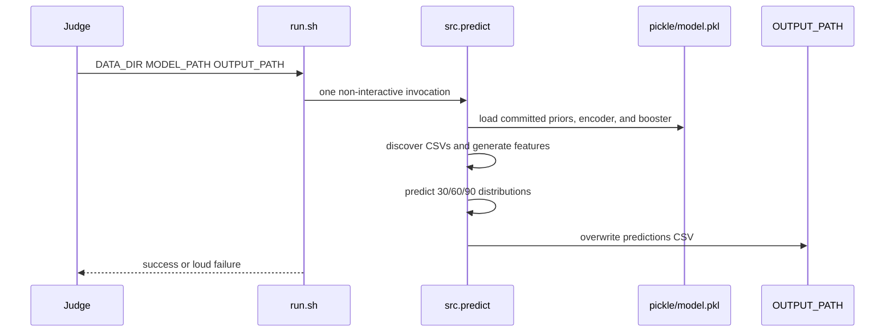
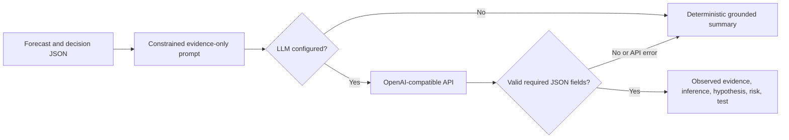

# Architecture Overview

## Stack

| Layer | Technology | Responsibility |
|---|---|---|
| Frontend | Streamlit, Plotly | Scenario controls, forecast ranges, model comparison, evidence, decisions, and downloads |
| Data layer | Python, pandas | Dynamic CSV discovery, platform normalization, quality checks, ontology, and budget-plan validation |
| Forecasting | NumPy, XGBoost | Empirical-Bayes priors, fitted booster inference, lifecycle logic, probabilistic simulation, and hierarchy reconciliation |
| Decision layer | Python | Target probability, evidence status, recommendation policy, and experiment routing |
| AI explanation | Python standard library plus Gemini and optional OpenAI-compatible endpoints | Grounded forecast chat, causal hypotheses, operational summaries, and deterministic fallback |
| Submission runner | Bash | One-command, non-interactive, offline prediction |

## Forecasting pipeline

```mermaid
flowchart LR
    A["CSV files in DATA_DIR"] --> B["Discover and normalize schemas"]
    B --> C["Validate quality and campaign consistency"]
    C --> D["Build lag, lifecycle, peer, category, and budget features"]
    D --> E["Empirical-Bayes center"]
    D --> F["Committed XGBoost booster"]
    E --> G["Guarded hybrid center"]
    F --> G
    G --> H["Zero-aware and launch-aware simulation"]
    H --> I["Seasonality, saturation, and correlated risk"]
    I --> J["Bottom-up hierarchy reconciliation"]
    J --> K["P10/P50/P90 revenue and ROAS"]
    K --> L["Target probability and evidence status"]
    L --> M["ACT / HOLD / TEST / REVIEW"]
    L --> N["Value-of-information experiment"]
```

## Offline judge path

The judge path does not import Streamlit, call an LLM, download weights, fit XGBoost, or mutate the model and input files.

## Interactive application path

The Streamlit application loads the same artifact and calls the same forecasting function as `run.sh`. Scenario controls change horizon, target ROAS, simulation depth, and channel budgets. The interface then exposes:

- decision overview and target probability;
- live empirical, XGBoost, and selected-hybrid scenario views;
- historical XGBoost/CatBoost model-selection evidence;
- channel, lifecycle, campaign, and evidence diagnostics;
- recommended experiment and grounded explanation;
- session-only Gemini questions grounded in the currently generated scenario;
- data-quality report and machine-readable output.

## LLM integration workflow

For direct Gemini chat, the key is entered through a password widget and kept in session memory. The user must consent before the forecast snapshot is transmitted. The fixed request sends the key only as an authentication header and sends an allowlisted context rather than raw daily history. The response is JSON-schema constrained and validated before rendering.

The LLM explains structured evidence; it never supplies numeric forecasts and never runs in the offline scoring command.

## Artifact boundary

The committed artifact contains compact distribution statistics, hashed campaign-analog keys, a capped category encoder, and XGBoost UBJ bytes. It does not contain raw organizer rows, raw names as features, or raw campaign IDs as features. At scoring time, unknown categories map to `__other__`, and sparse runtime groups retain committed fallbacks.
